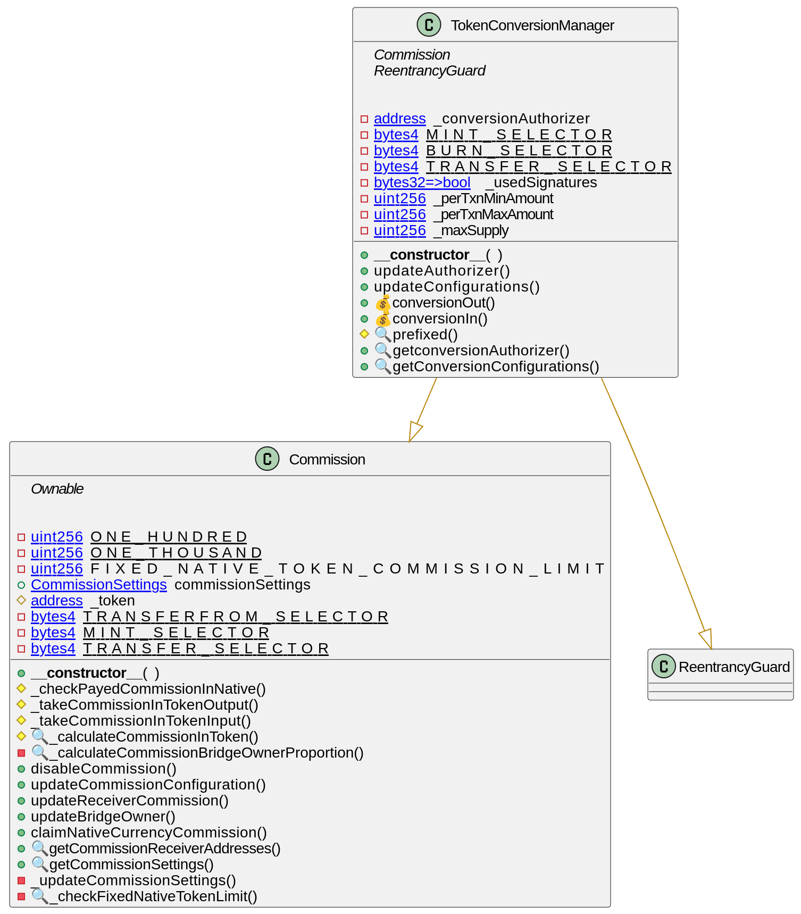

# Installation

Recommended using WSLv2/Linux/MacOS with LTS Node >= 18 & NPM >= 10 version

**Table of Contents**

- [Installation](#installation)
- [Commands to launch tests](#commands-to-launch-tests)
- [Use Case](#use-case)
- [Functionality](#functionality)
  - [Converter Contract functionality requirements](#converter-contract-functionality-requirements)
  - [Commission Contract functionality requirements](#commission-contract-functionality-requirements)
- [Technical requirements](#technical-requirements)
  - [Project components](#project-components)
  - [`Token Conversion Manager` Contract](#token-conversion-manager-contract)
    - [Key-functions](#token-conversion-manager-key-functions)
    - [State variables](#token-conversion-manager-state-variables)
  - [`Commission Contract`](#commission-contract)
    - [Key-functions](#commission-key-functions)
    - [State variables](#commission-state-variables)
  - [Technologies used in the project](#technologies-used-in-the-project)
  - [Architectural design](#architectural-design)

## Installation

1. Install dependencies
```bash
    npm install
```

## Commands to launch tests
The `Token.sol` file with a sample token contract is only needed to run the tests(Not for audit).

2. Run Tests
```bash
    npx hardhat test
```

# Use case

A contract is needed to burn and mint tokens as part of the bridge between blockchains.

The contract will receive data about the transfer between different blockchains, including the signature that is generated on the backend, thereby verifying the transaction.

# Functionality

## Converter Contract functionality requirements

As part of the functionality, the contract should be able to burn the users tokens for later issuance on another blockchain.

The converter contract should also be able to issue a validated number of tokens when using a specific role in the token.

The contract validates the minimum and maximum number of tokens within each conversion transaction. And also prevent exceeding the maximum number (max supply) of issued tokens for the token being used.

## Commission Contract functionality requirements

The contract can take a commission in tokens and in ETH

Charged amount of commission is distributed between the two recipients in a set proportion of the amount of the commission charged

* % of conversion amount

* fix tokens commission for each amount of conversion

* fix ETH amount for each conversion regardless of the amount

Contract allowed to change any settings: commission receivers, value of commision, min, max amount of conversion, etc

A detailed description of the contract's capabilities and mechanics of its use can be found in the [document](https://docs.google.com/document/d/1eyqZTU7vKpZ077GCq9VA9RCwvlW_M6825YjYtDXvMbE/edit?usp=sharing).


# Technical requirements

##  Project components

###  `Token Conversion Manager` Contract

The `TokenConversionManager` contract manages token conversions between Ethereum and non-Ethereum networks with signature verification. Signature is received from backend service and is used in order to prevent replay attacks. Key functionalities include updating authorizer address (backend service address actually) and configurations, and executing conversions in and out.

#### `Token Conversion Manager` Key-functions
- **constructor**
  - **Description**: Initializes the contract with token address, commission settings, and sets the conversion authorizer to the deployer.

- **conversionOut**
  - **Parameters**: `uint256 amount, bytes32 conversionId, uint8 v, bytes32 r, bytes32 s`
  - **Description**: Converts tokens from Ethereum to non Ethereum network. The tokens which needs to be convereted will be burned on the Ethereum network. The conversion authorizer needs to provide the signature to call this function.

- **conversionIn**
  - **Parameters**: `address to, uint256 amount, bytes32 conversionId, uint8 v, bytes32 r, bytes32 s`
  - **Description**: Converts tokens in (mints them) after verifying the signature and preventing replay attacks.

- **updateAuthorizer**
  - **Parameters**: `address newAuthorizer`
  - **Description**: Updates the conversion authorizer address. Only callable by the contract owner.

- **updateConfigurations**
  - **Parameters**: `uint256 perTxnMinAmount, uint256 perTxnMaxAmount, uint256 maxSupply`
  - **Description**: Updates the conversion configuration limits. Only callable by the contract owner.

- **getconversionAuthorizer**
  - **Returns**: `address`
  - **Description**: Returns the current conversion authorizer address.

- **getConversionConfigurations**
  - **Returns**: `(uint256, uint256, uint256)`
  - **Description**: Returns the current conversion configuration limits.

</br>

#### `Token Conversion Manager` State variables

- **_conversionAuthorizer**
  - **Type**: `address`
  - **Description**: Stores the address of the entity authorized to approve conversions.

- **MINT_SELECTOR, BURN_SELECTOR, TRANSFER_SELECTOR**
  - **Type**: `bytes4`
  - **Description**: Constants storing function selectors for minting, burning, and transferring tokens.

- **_usedSignatures**
  - **Type**: `mapping (bytes32 => bool)`
  - **Description**: Tracks used conversion signatures to prevent replay attacks.

- **_perTxnMinAmount, _perTxnMaxAmount, _maxSupply**
  - **Type**: `uint256`
  - **Description**: Configurations for minimum and maximum transaction amounts and maximum total supply.

</br> </br>

###  `Commission` Contract

The `Commission` contract module manages commission settings and calculations for a bridge contract. It includes functionality for enabling/disabling commissions, calculating different types of commissions, and handling commission transfers.

#### `Commission` Key-functions:

- **constructor**
  - **Parameters**: Various commission settings
  - **Description**: Initializes the commission settings.

- **disableCommission**
  - **Description**: Disables the commission. Only callable by the contract owner.

- **updateCommissionConfiguration**
  - **Parameters**: Various commission settings
  - **Description**: Updates the commission configuration.Only callable by the contract owner.

- **updateReceiverCommission**
  - **Parameters**: `address newReceiverCommission`
  - **Description**: Updates the receiver commission address. Only callable by the contract owner.

- **updateBridgeOwner**
  - **Parameters**: `address newBridgeOwner`
  - **Description**: Updates the bridge owner commission address. Only callable by the contract owner.

- **claimNativeCurrencyCommission**
  - **Description**: Claims the native currency commission. Only callable by bridge owner or commission receiver addresses

- **getCommissionReceiverAddresses**
  - **Returns**: `(address, address)`
  - **Description**: Returns bridge owner and commission receiver addresses

- **getCommissionSettings**
  - **Returns**: Various commission settings
  - **Description**: Returns the current commission settings.

- **_takeCommissionInTokenOutput**
  - **Parameters**: `uint256 amount`
  - **Description**: Takes a commission in tokens during conversion out.

- **_takeCommissionInTokenInput**
  - **Parameters**: `uint256 amount`
  - **Description**: Takes a commission in tokens during conversion in.

- **_calculateCommissionInToken**
  - **Parameters**: `uint256 amount`
  - **Description**: Calls `_calculateCommissionBridgeOwnerProportion` and returns commission amount for bridge owner and the whole sum of commission.

- **_calculateCommissionBridgeOwnerProportion**
  - **Parameters**: `uint256 amount`
  - **Description**: Calculates the bridge owner's proportion of the commission.


</br>

#### `Commission` State variables

- **ONE_HUNDRED, ONE_THOUSAND**
  - **Type**: `uint256`
  - **Description**: Constants for percentage calculations.

- **FIXED_NATIVE_TOKEN_COMMISSION_LIMIT**
  - **Type**: `uint256`
  - **Description**: Immutable limit for fixed native token commission.

- **commissionSettings**
  - **Type**: `struct CommissionSettings`
  - **Description**: Stores commission settings including percentages, proportions, and addresses.

- **_token**
  - **Type**: `address`
  - **Description**: Address of the token contract.

- **TRANSFERFROM_SELECTOR, MINT_SELECTOR, TRANSFER_SELECTOR**
  - **Type**: `bytes4`
  - **Description**: Constants storing function selectors for token operations.


##  Technologies used in the project
 - Solidity - smart contracts' language
 - Hardhat - framework for testing smart contracts

##  Architectural design
 
<p align="center">
    </img>
</p>